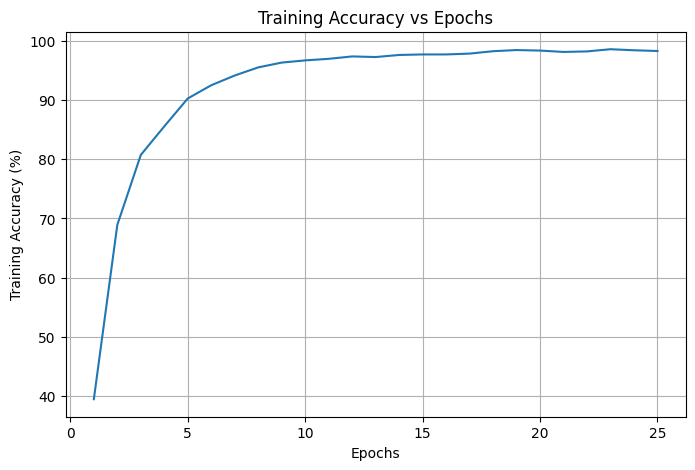
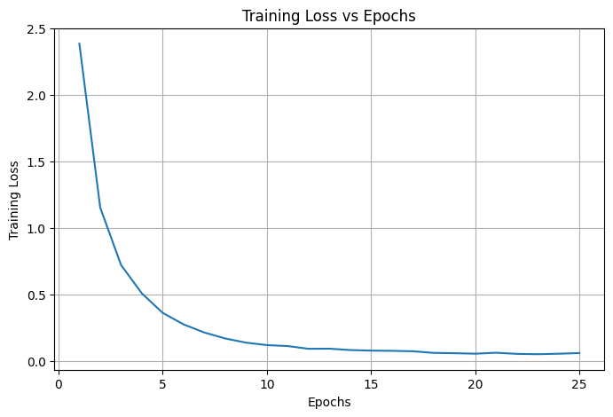
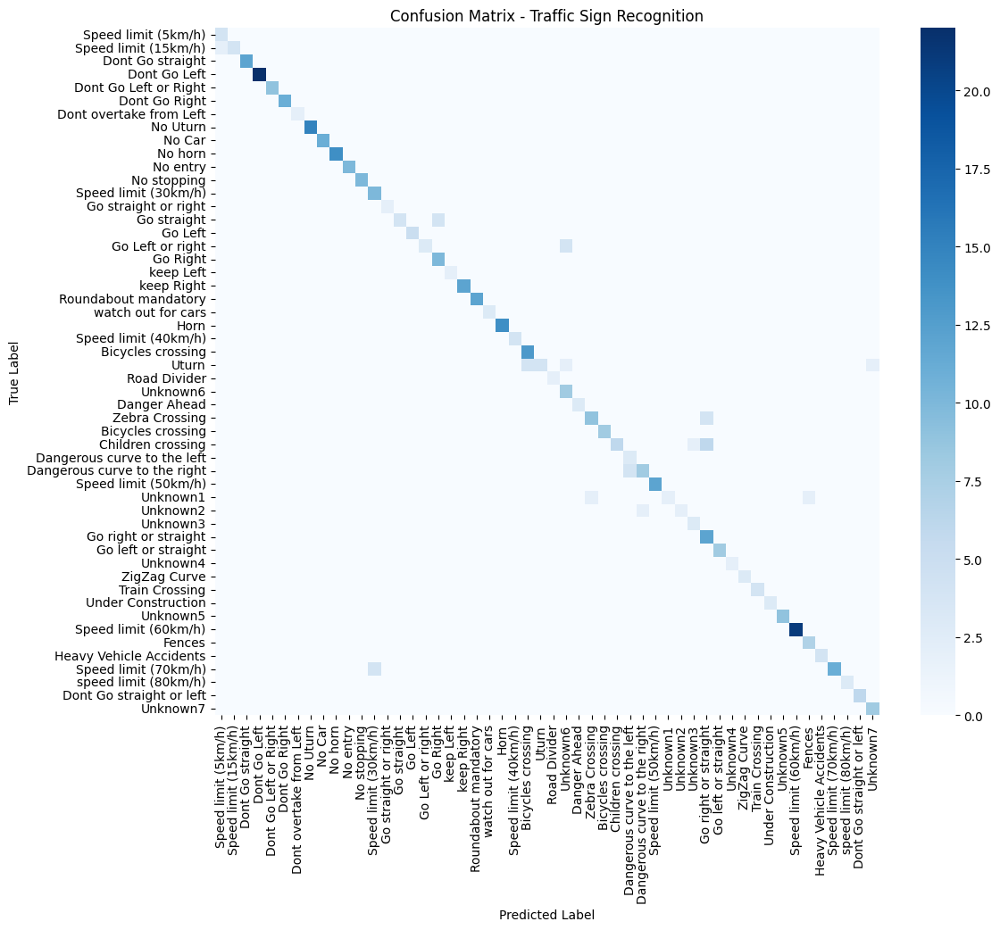

# 🚦 Traffic Sign Recognition System (CNN + PyTorch)

This project implements a **Traffic Sign Recognition System** using a **Convolutional Neural Network (CNN)** built with **PyTorch**.  
The trained model is deployed using **Streamlit** to provide a simple and interactive web interface where users can upload an image and get the predicted traffic sign with confidence.

---

## 📌 Features
- CNN-based image classification using PyTorch
- Correct label mapping (no class mismatch issues)
- High-confidence predictions
- Training on Google Colab with GPU support
- Deployment using Streamlit (VS Code)
- Accuracy vs Epoch plot
- Confusion Matrix for evaluation

---

## 🗂 Project Structure

```

Traffic_Sign_App/
│
├── images
    ├── accuracy_vs_epoches.png
    ├── loss_vs_epoches.png
    ├── confusion_matrix.png    
├── traffic_dataset     # dataset
├── app.py      # Streamlit application
├── model.py    # CNN model definition
├── traffic_sign_model.pth     # Trained model weights
├── class_id_to_name.json      # Correct class-to-label mapping
├── Traffic_RecognitionCNN.ipynb   #notebook
├── README.md   # Project documentation

```

 📊 Dataset Structure

```

traffic_dataset.zip
│
├── DATA/
│ ├── 0/
│ ├── 1/
│ ├── 2/
│ └── ...
│
├── TEST/
│ ├── 0/
│ ├── 1/
│ └── ...
│
└── labels.csv

```
- Folder names represent **Class IDs**
- `labels.csv` maps each `ClassId` to a traffic sign name

---

## 🧠 Model Architecture
- 2 Convolutional layers
- Batch Normalization
- ReLU activation
- Max Pooling
- Fully connected classifier
- Dropout for regularization

---

## ⚙️ Training (Google Colab)
- Image size: `32 × 32`
- Optimizer: Adam
- Loss function: CrossEntropyLoss
- Epochs: 25
- Normalization applied consistently
- GPU enabled

### Evaluation Metrics
- Training Accuracy vs Epoch plot
- Test Accuracy
- Confusion Matrix

---

## 🖥 Deployment (Streamlit)
Users can:
- Upload a traffic sign image
- View the predicted sign name
- See confidence score

Run the app:
```bash
streamlit run app.py

```

📈 Results

Correct traffic sign labels displayed

High confidence predictions

Stable and consistent performance

Works well for real-world images

Example Output
Traffic Sign: Speed limit (50km/h)

Confidence: 92.34%


## 📊 Model Performance

### 🔹 Training Accuracy vs Epochs
The plot below shows the training accuracy improving across epochs, indicating stable learning and convergence.



### 🔹 Training Loss vs Epochs
The plot below shows the training loss reducing across epochs, indicating stable learning and convergence.



---

### 🔹 Confusion Matrix
The confusion matrix visualizes classification performance across all traffic sign classes and helps identify commonly confused signs.




## Key Learning Outcomes

CNN implementation using PyTorch

Handling class index mismatches in ImageFolder

Model training and evaluation

Deployment of ML models using Streamlit

Debugging real-world ML pipeline issues
